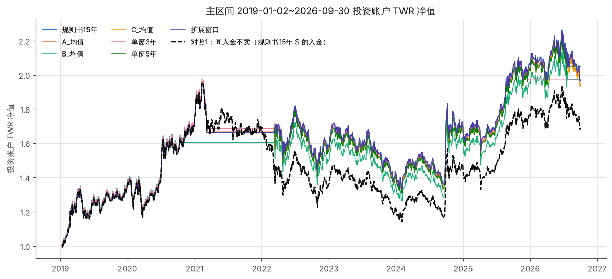
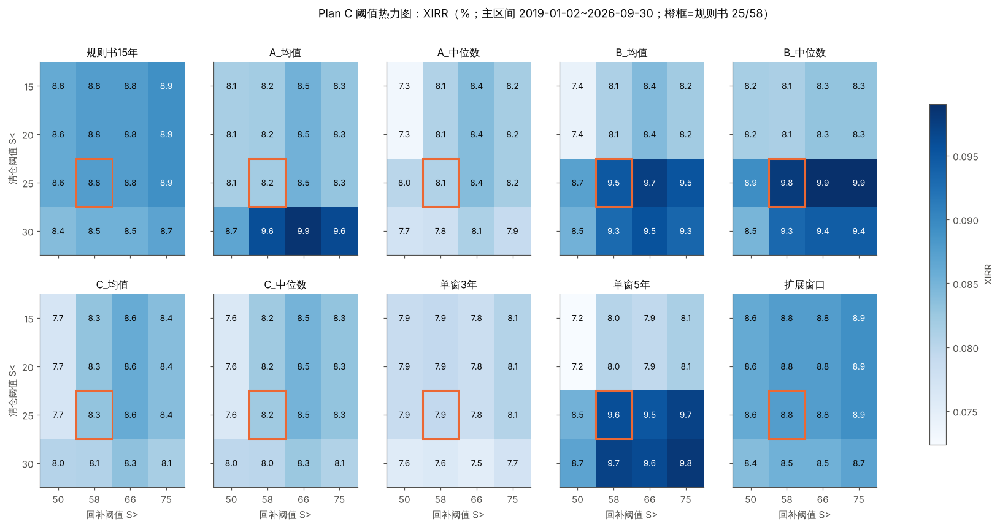
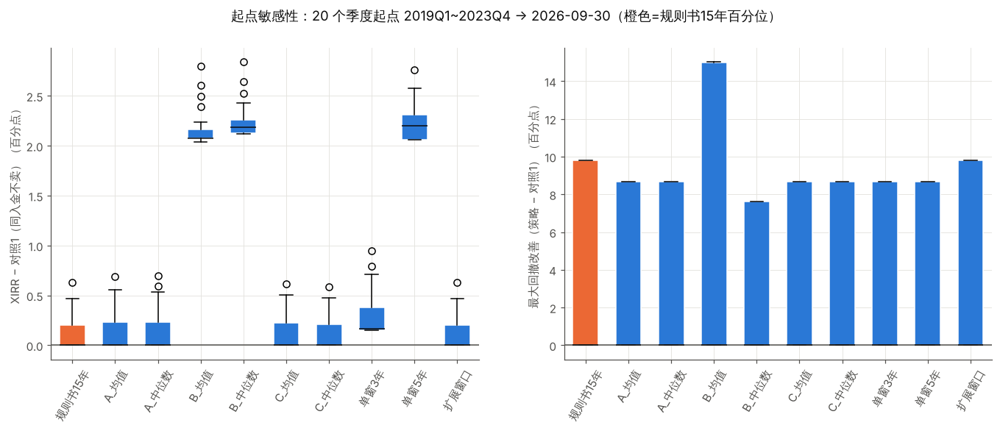
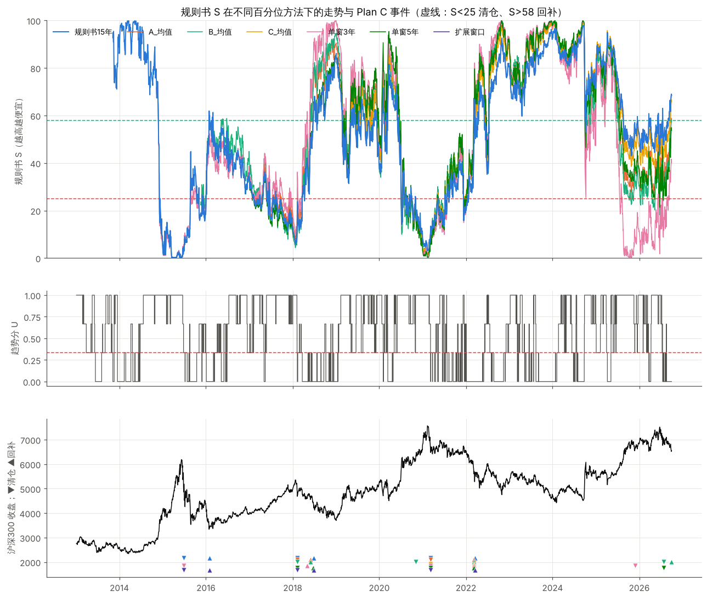

# Plan C 规则书回测：只换"百分位方法"，其余规则冻结

> 代码 `plan_c.py`（复用 `backtest.py` 的数据读取和统计工具）。全部表格见 [`output_planc/results_tables.md`](output_planc/results_tables.md)，图在 `output_planc/figures/`。
> 研究目的：Plan C 的交易规则一字不改，只把 S 里的"百分位"换成原需求的各种窗口方案，看结论有多依赖百分位的算法。

## 0. 结论先行

1. **规则书的原始结果可以复现。** 6 次清仓/回补的日期和成交价与规则书完全一致；累计本金、期末价值、最大回撤的误差都在 0.1% 以内。
   - **规则书写的"XIRR 11.59%"其实是连续复利口径**，即 ln(1+12.29%)。按 Excel XIRR 的标准年复利口径应为 **12.29%**。
2. **在本数据上，规则书的"15 年滚动窗口"其实就是扩展窗口。** 数据从 2011-09 开始，正好 15 年，窗口一天都没滚动过，所以它的事件和"扩展窗口"方案完全相同。真正的 15 年滚动要等到 2026 年以后才会出现差别。
3. **百分位方法改变的是"哪几次事件会触发"，不改变规则的基本形态。** 主比较区间（2019-01 起同日开始定投）内：
   - 10 种可评估方法的 XIRR 为 7.9% ~ 9.8%，都比"同样入金、永不卖出"（对照1）高 0.6 ~ 2.3 个百分点；
   - 最大回撤从对照1 的 −41.7% 降到 −26.7% ~ −34.0%。
   - 但这段时间里各方法只发生过 **1 ~ 2 次**清仓，结果几乎完全由 2021-03-09 那一次离场决定。
4. **规则书 12.3%（连续复利 11.6%）的成绩，主要来自起点 + 2015 年那一次事件。** 从 2013-11 或 2014-01 起步时，XIRR 比对照1 高 4.4 个百分点；同一套规则从 2015-01、2016-02、2017-01、2019-01 起步，只高 0.6 ~ 1.0 个百分点，XIRR 约 8.7%。原因是：从 2013 ~ 2014 年起步，低估值时期积累了大量本金，又在 2015 年 4857 点清仓、3444 点回补。这只是一次事件，不可重复。
5. **主区间里 XIRR 最高的方法（B 组合、单窗 5 年，比其他方法多 +1.5pp）属于过拟合。** 多出来的部分只来自 2026-07-24 一次清仓，当时 S 为 24.1 ~ 24.8，离 25 的阈值只差 0.2 ~ 0.9 分。把清仓阈值改成 20，这部分优势就消失了（热力图上是一个台阶）。
6. **单窗 3 年有害**：2015-06 清仓后一直等到 2018-05 才回补，错过了 2016 ~ 2017 年的上涨。自身全区间的 TWR 只有 5.1%，是所有方法里最低的。它目前（2025-11-25 起）仍处于清仓状态。
7. **统计上无法下结论。** 352 个试验之间的 TWR 日收益平均相关 0.946，特征值口径的有效试验数约 1.1；按夏普选优的 PBO = 0.63。整个回测期只有 3 次左右的清仓事件，DSR 和 PBO 只能作为参考，**样本量本身就不足以证明这套规则有效**。规则书末尾也承认了这一点。

---

## 1. 规则实现（逐条对照规则书）

| 规则书条款 | 实现 |
|---|---|
| ERP = 100/PE-TTM − 10Y | 同 |
| S = [(100 − PB 分位) + 股息率分位 + ERP 分位] / 3 | 同，分位 = `rank(pct=True)×100`（并列取平均名次） |
| 百分位：15 个日历年滚动、≥504 样本 | `rolling('5479D', min_periods=504)`；S 首个有效日为 2013-11-07，与规则书一致 |
| U = [I(P>MA40)+I(P>MA80)+I(P>MA160)]/3，等于均线不算站上 | 同（严格大于） |
| T−1 收盘的 S、U 决策，T 日收盘价成交 | 同 |
| 清仓：S<25 且 U≤1/3 → 全部赎回（扣 0.5%）进资金池，当日不定投 | 同 |
| 等待期：S>58 → 资金池全额回补（扣 0.12%），恢复定投 | 同；**回补当日不再另行定投**（规则书没有明确规定，这样处理与规则书的本金数字吻合） |
| 定投：250 × clip((S−30)/70, 0, 1)^2.5；挂账满 10 元成交；扣 0.12% | 同；当日额度 = 当日外部入金，不累积 |
| 资金池、挂账不计利息 | 同 |

**两处口径说明：**
- XIRR：表中"XIRR"为标准年复利口径，"XIRR连续复利"与规则书口径一致。
- TWR：投资账户的时间加权收益，r_t = (V_t − 当日入金)/V_{t−1} − 1，**从账户规模 ≥ 1000 元起计**。账户规模很小时，新入金的申购费会被放大成虚假的大幅亏损（曾出现过单日 −84000% 的计算异常）。因此 TWR 为 12.4%，规则书为 12.57%，差异来自起步阶段的计法。

**复现结果（表 0）：**

| | 规则书 | 本实现 |
|---|---|---|
| 累计外部本金 | 161,694 | 161,780 |
| 期末价值 | 362,788 | 362,994 |
| XIRR（连续复利口径） | 11.59% | 11.59% |
| XIRR（标准口径） | — | 12.29% |
| 最大回撤 | −31.8% | −31.8% |
| 清仓/回补 | 2015-06-29 / 2016-01-29；2018-02-08 / 2018-06-26；2021-03-09 / 2022-03-16 | **完全一致**（S 值 4.7 / 61.9 / 11.9 / 59.0 / 11.1 / 66.9） |

## 2. 测试设计

- **百分位方法（11 种）**：
  - 规则书 15 年（基线）；
  - 原需求的 A(3,5,7,10)、B(2,4,6,8)、C(5,7,10,12)，各配均值/中位数两种聚合，至少 2 个窗口有值；
  - 单窗 3 / 5 / 10 年；
  - 扩展窗口（至少 3 年）。
- **S 的构成（5 种）**：规则书的 PB+DY+ERP；另外让四个指标各自单独作为 S，以满足原需求"四个指标分别计算"。PE 不在规则书的 S 里，这里单独测试。
- **阈值**：
  - 原需求的 15/85 … 30/70，对应到这里是清仓阈值 S<15/20/25/30（S<25 等价于"贵度 >75"）；
  - 另加回补阈值 50/58/66/75，组成 4×4 网格。
- **试验总数 352** = 5 × 11 × 4（回补固定 58）+ 规则书 S × 11 × 其余 12 格。
- **对照**：
  - 对照1：同样的每日入金，永不卖出。这样可以把"估值加权定投"和"清仓/回补择时"分开看；
  - 对照2：总本金相同的每日等额定投；
  - 另附沪深300 一次性买入持有。
- **区间**：
  - 规则书区间（2013-11-08 起）：只有规则书 15 年这一种方法有信号；
  - 主比较区间 2019-01-02 ~ 2026-09-30：所有方法同一天开始定投，单窗 10 年除外；
  - 另外给出各方法从自身首个有效日起的结果。

## 3. 主比较区间结果（规则书 S，阈值 25/58，2019-01-02 同日起步）

| 百分位方法 | XIRR | 对照1 XIRR | 差 | TWR年化 | 夏普 | 最大回撤 | 卡玛 | 平均仓位 | 清仓次数 | 交易次数 | 年换手 |
|---|---|---|---|---|---|---|---|---|---|---|---|
| 规则书15年 | 8.8% | 8.1% | +0.6 | 9.2% | 0.59 | −31.9% | 0.29 | 86.8% | 1 | 1346 | 0.04 |
| A_均值 | 8.2% | 7.5% | +0.7 | 9.0% | 0.58 | −33.0% | 0.27 | 87.1% | 1 | 1190 | 0.05 |
| A_中位数 | 8.1% | 7.4% | +0.7 | 9.0% | 0.57 | −33.0% | 0.27 | 87.1% | 1 | 1224 | 0.05 |
| B_均值 | 9.5% | 7.5% | +2.0 | 9.2% | 0.60 | −26.7% | 0.35 | 80.1% | 2 | 1151 | 0.37 |
| B_中位数 | 9.8% | 7.5% | +2.3 | 9.7% | 0.62 | −34.0% | 0.29 | 84.6% | 2 | 1165 | 0.38 |
| C_均值 | 8.3% | 7.7% | +0.6 | 9.0% | 0.57 | −33.0% | 0.27 | 87.1% | 1 | 1297 | 0.04 |
| C_中位数 | 8.2% | 7.6% | +0.6 | 9.0% | 0.57 | −33.0% | 0.27 | 87.1% | 1 | 1321 | 0.04 |
| 单窗3年 | 7.9% | 7.0% | +0.9 | 9.2% | 0.61 | −33.0% | 0.28 | 76.0% | 2 | 1123 | 0.21 |
| 单窗5年 | 9.6% | 7.3% | +2.3 | 9.7% | 0.62 | −33.0% | 0.30 | 84.5% | 2 | 1189 | 0.22 |
| 单窗10年 | — | — | — | — | — | — | — | — | — | — | — |
| 扩展窗口 | 8.8% | 8.1% | +0.6 | 9.2% | 0.59 | −31.9% | 0.29 | 86.8% | 1 | 1346 | 0.04 |

- 对照1 的最大回撤为 −41.7%；对照2（等额定投）的 XIRR 为 4.0%；沪深300 一次性买入持有：年化 7.6%，夏普 0.49，最大回撤 −41.6%。
- 交易次数的绝大部分是定投成交，清仓和回补各只有 1 ~ 2 次。累计本金、期末价值等完整列见结果表的表 3。
- 估值加权定投本身的贡献，远大于清仓/回补择时：对照1 比对照2 高约 3 ~ 4 个百分点；择时只再多出 0.6 ~ 2.3 个百分点。
- **四个指标单独作为 S（表 4）**：
  - DY、PB 与规则书 S 相近（比对照1 高 +0.5 ~ +3.2pp）；
  - ERP 较弱（−0.4 ~ +1.7pp，10 种方法里只有一半跑赢对照1）；
  - **PE 不稳定**：单窗 3 年为 −3.4pp；清仓阈值改成 30 时，A/B 组合的 XIRR 跌到 3.2% ~ 3.4%。规则书没有把 PE 直接放进 S，这个结果支持这一设计。



## 4. 过拟合检查

### 4.1 试验次数与 DSR（表 6）

- 352 个试验中，主区间可评估 320 个。TWR 日收益平均相关 0.946；有效试验数：平均相关口径 18.3，特征值口径 1.1。
- 按 TWR 夏普选出的最优：S=DY · 单窗5年 · 25/58（夏普 0.66）。按 XIRR 选出的最优：S=DY · B_中位数（10.8%）。
- DSR：
  - 检验"TWR 夏普 > 0"：0.91 ~ 0.97；
  - 检验"相对对照1 的 IR > 0"：N = 352 时为 0.56，有效 N = 18.3 时为 0.73，有效 N = 1.1 时为 0.93。
- **CSCV**：按夏普选优 PBO = 0.63（样本内到样本外的回归斜率 −1.17）；按 IR 选优 PBO = 0.38。
- **解读**：这个策略的超额收益只由 1 ~ 3 次事件决定，日收益序列并不满足 DSR/PBO 的前提，所以上面的数字偏乐观也偏不稳定。真正有约束力的是下面的"事件层面"检查。

### 4.2 阈值稳健性



- **规则书 15 年 / 扩展窗口**：16 格 XIRR 在 8.4% ~ 8.9% 之间，非常平坦。规则书的 25/58 排第 6/16，不是挑出来的尖峰。但最大回撤在 −22.7% ~ −34.0% 之间变化（表 5、`fig_heatmap_mdd.png`）。
- **A / C / 单窗 3 年**：变化也平缓，只是清仓阈值为 30 时会多或少触发一次事件。
- **B / 单窗 5 年**：清仓阈值从 20 到 25 有一个约 1.5pp 的台阶。这个台阶就是 2026-07-24 那次 S≈24.1 ~ 24.8 的擦边清仓：阈值 25 时触发，阈值 20 时不触发。主区间的"最优"恰好落在这个台阶上，是典型的阈值敏感。
- 清仓阈值 15/20 时，多数方法在 2021 年也照样清仓，因为当时 S 低到 7 ~ 11。**回补阈值是更敏感的一维**：A_中位数、B_均值、C_均值、C_中位数、单窗5年在回补阈值 50 时，2021 年清仓后很快回补，随后的下跌没躲过，最大回撤回到 −42%，和不择时一样。

### 4.3 起点敏感性（表 7）

- **需求区间 2010Q1 ~ 2016Q4（28 个起点）**：规则书 15 年有 12 个可行起点（2014Q1 起），B 有 4 个，单窗 3 年和扩展窗口各 8 个；A、C、单窗 5 年、单窗 10 年一个都没有。
  - 规则书 15 年在这 12 个起点上 XIRR 为 8.7% ~ 12.3%，**全部跑赢对照1**（中位数 +1.0pp）。但其中只有 2014 年的起点能拿到 +4.4pp 左右，2015 年及以后的起点只有 +1.0pp 左右。
- **公共起点 2019Q1 ~ 2023Q4（20 个）**：
  - 没有一个起点跑输对照1；
  - 但规则书 15 年、A、C、扩展窗口在 60% ~ 65% 的起点上**与对照1 完全相同**：2021Q2 以后起步就再也没有触发过清仓；
  - B 和单窗 5 年在全部起点上都多出约 +2.1 ~ +2.8pp，几乎全部来自 2026-07 那一次事件。



### 4.4 子区间（表 8；各方法从自身首个有效日起连续运行后截取）

| 子区间 | 沪深300 | 规则书15年 | 其他方法 |
|---|---|---|---|
| 2015 泡沫 | +12.7%，MDD −46.1% | +57.9%，MDD −23.8%（2015-06-29 清仓，2016-01-29 回补） | 只有单窗 3 年、扩展窗口有信号，而且这两个账户 2014-11 才建立，本金很少，TWR 不可比；A/B/C 集成均无信号 |
| 2018 熊市 | −29.2% | −20.7%（2018-02-08 清仓，06-26 回补） | A：−10.2%；B：−26.1%（05-31 回补过早）；单窗5年：−15.0%；单窗3年：−18.6%（还在 2015 年那次清仓的等待期中，05-03 回补） |
| 2021 高点前后 | −11.5%，MDD −37.2% | +3.3%，MDD −26.7% | 几乎所有方法都在 2021-03-09 清仓、2022-03-09 ~ 16 回补，结果为 +0% ~ +3.3%；**B_均值在 2020-11-02 提前清仓，反而只有 −3.6%** |
| 2024 年以来 | +37.2% | +37.2%（无事件） | B、单窗5年：+45%（2026-07 清仓）；单窗3年：+37.7%（2025-11 清仓后一直空仓） |

### 4.5 指标一致性（表 9）

- PB、DY、ERP、PE 的便宜度分位两两相关 0.68 ~ 0.93。规则书 S 的三个分量（PB/DY/ERP）之间相关 0.90 ~ 0.92，所以 S 实质上接近单一因子。
- 在关键高点（2015-06、2018-01、2021-02），规则书 S 为 0 ~ 10，三个分量一致判断"极贵"。这时 U = 1，也就是仍在上升趋势里，所以不会立刻清仓，要等到趋势破坏才触发。
- 在关键低点（2019-01、2022-10、2024-02、2024-09），S 为 86 ~ 100，一致判断"便宜"。
- 2016-01 低点的 S 只有 54 ~ 62，刚刚越过回补线。
- **2026-06-22 近期高点出现背离**：规则书 S 为 43（中性），短窗口和 A/B 组合为 2 ~ 28（偏贵），C 组合为 36 ~ 39，单窗 10 年为 43。从分量看，PE 便宜度只有 6（贵），PB 为 43，DY 为 53。这就是不同窗口在 2026 年给出不同动作（清仓或不清仓）的根源。

### 4.6 窗口组合与聚合方式差异（表 10、11）



- **均值与中位数**：A 组合两者的事件完全相同；C 组合两者的事件也相同，只是 S 值略有差异。只有 B 组合不同：B_均值在 2020-11-02（S = 23.4）提前清仓，B_中位数没有。说明中位数对 2 年窗口这个离群值更稳健。
- **A vs C**：在主区间内事件几乎相同。C 没有 2018 年的事件，只是因为它 2018-12 才有信号。
- **背离来源**：
  - **2 年和 3 年短窗口**：在 2026 年把 S 压到 25 以下，触发 B 和单窗 5 年的 2026-07 清仓；
  - **单窗 3 年**：2015 年后 S 长期达不到 58，导致等待了 3 年；
  - **10 年窗口**：2022-01 刚出值的第一天 S 为 24.7，又恰逢 U ≤ 1/3，触发一次清仓。这是预热造成的伪事件。
- **规则书 15 年（实为扩展）与 C 最接近**：主区间内 S 的平均绝对差为 4.5，与单窗 3 年的差最大（13.9）。窗口越长，S 越平滑，事件越少，结果也越接近对照1。

## 5. 分类

这是在看到结果后、按原需求的维度做出的判断，不是事先写定的规则，请据此打折看待。

| 类别 | 百分位方法（规则书 S） | 理由 |
|---|---|---|
| **相对稳健，但效果小** | 规则书15年（= 扩展窗口）、A_均值、A_中位数、C_均值、C_中位数 | 阈值网格平坦；所有起点都不跑输对照1；主区间超额 +0.6 ~ +0.7pp，全部来自 2021 年那一次离场；回撤改善约 9 ~ 10 个百分点 |
| **可能过拟合** | B_均值、B_中位数、单窗5年 | 超额领先完全来自 2026-07 那一次擦边事件（S 离阈值不到 1 分）；阈值从 20 改成 25 时出现台阶；B_均值还多了一次 2020-11 的过早清仓 |
| **无效或有害** | 单窗3年；以及 S=PE（单窗3年、清仓阈值 30 时）、S=ERP（一半方法跑输对照1） | 单窗 3 年的等待期太长，错过了 2016 ~ 2017 的上涨；PE 和 ERP 单独作 S 时，结果对方法和阈值都很敏感 |
| 无法评估 | 单窗10年 | 2022-01 才出值，首日就是预热造成的伪清仓 |

**敏感性汇总：**

| 维度 | 是否敏感 | 说明 |
|---|---|---|
| 窗口组合 | 中等 | A、C 与规则书一致；B 和短窗口改变了 2026 年的事件 |
| 聚合方式 | 低 | 只有 B 组合的均值版多了一次 2020-11 清仓 |
| 阈值 | 规则书 S 低；B / 单窗 5 年在清仓阈值 25 附近高 | — |
| 起点 | **高** | 这是规则书 12.3% 与"约 8.7%"之间差距的主要来源 |

## 6. 局限

1. **整个回测期只有约 3 次清仓事件**，统计检验基本无效。参数稳健只能说明"不是挑出来的尖峰"，不能说明"有效"。
2. **规则书的"15 年滚动"在本数据上无法与扩展窗口区分**，因此无法测试它真正滚动时的行为（2026 年以后，2011 年的数据开始移出窗口）。
3. **XIRR 依赖资金流的时点。** 规则书的头条成绩依赖 2013 ~ 2014 年在低估值区间大量入金，换一个起点就无法复现。
4. **价格序列疑似全收益指数**（见 `REPORT.md` 第 1 节）。规则书描述的是"场外净值"成交，如果实际基金净值与这个序列不一致，结果也会不同。
5. **资金池和挂账不计利息**，对清仓期较长的方法不利，主要是单窗 3 年。
6. **股息率数据有除息期跳变**，PE/PB 是否为时点数据也未核实（同 `REPORT.md`）。

## 7. 当前状态（2026-09-30，仅供参考）

- 规则书 15 年：S = 68.5，正常定投。
- 单窗 3 年：2025-11-25 起清仓，S = 40，仍在等待。
- 单窗 5 年：2026-07-24 起清仓，S = 54，仍在等待。
- B 组合：2026-09-29 已回补。
- U = 0，三条均线都在价格上方。

## 8. 复现

```bash
cd hs300_strategy/valuation_timing
python plan_c.py      # 约 30 秒，输出 output_planc/
```
