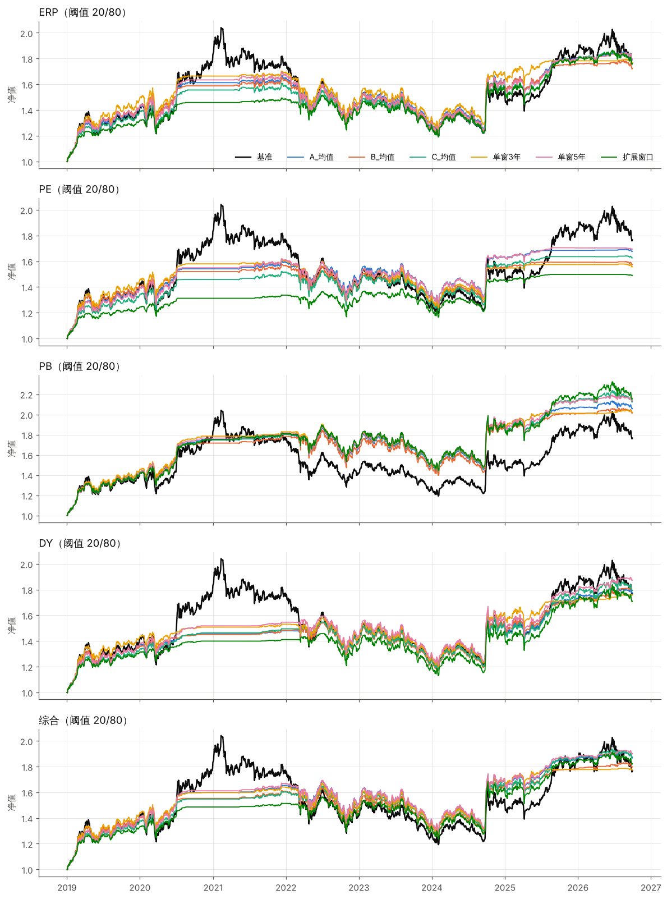
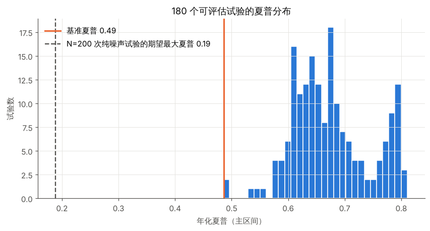
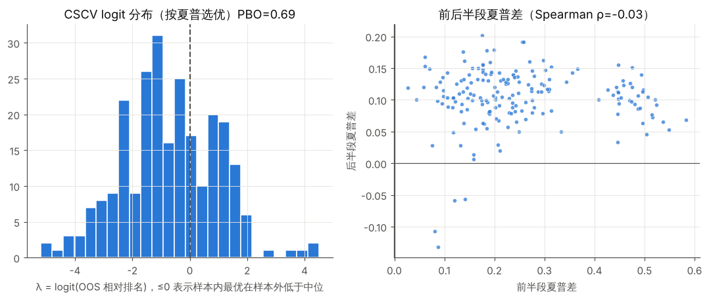
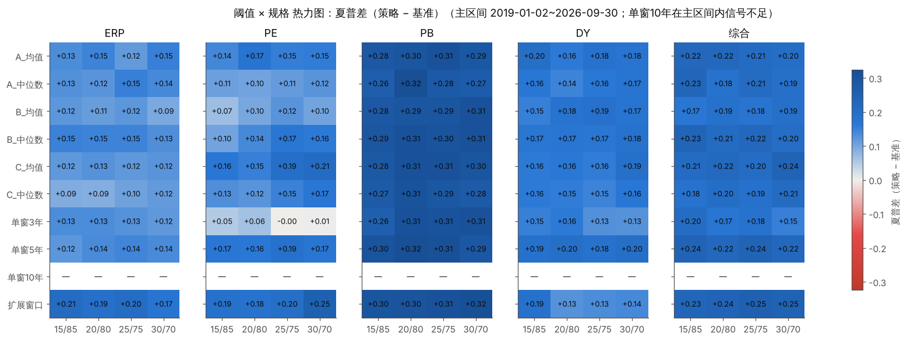
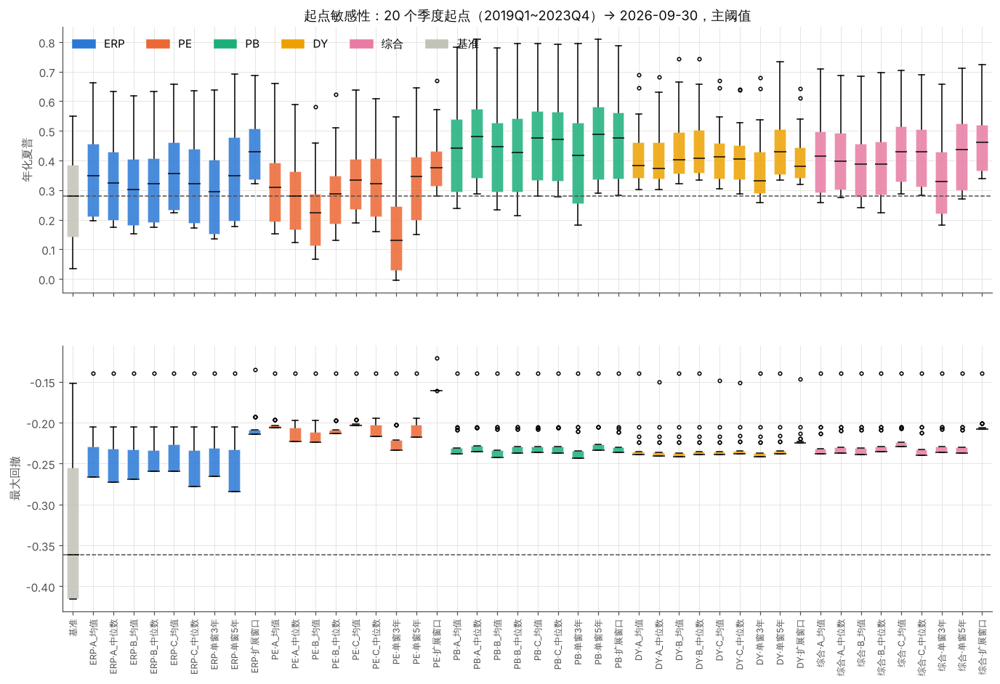
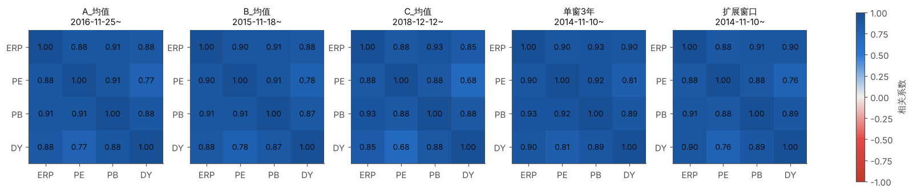
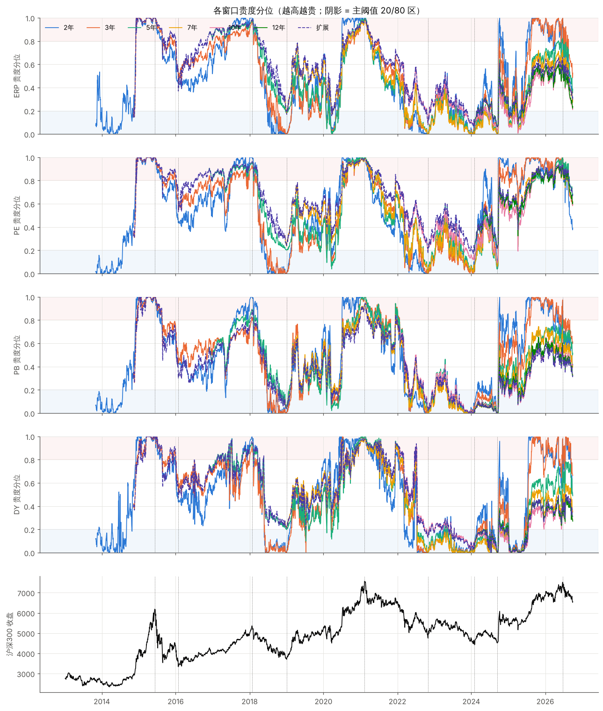

# 沪深300 估值择时：多滚动窗口集成百分位回测与过拟合检查

> 完整数字表见 [`output/results_tables.md`](output/results_tables.md)（脚本自动生成，含全部 200 个试验）。本报告的所有数字都来自 `python backtest.py` 的输出，可复现。

## 0. 结论先行

1. **"估值高就减仓"这一类规则，在 2019-01 ~ 2026-09 的样本内能稳定降低波动和回撤，但没有可靠地提高收益。**
   - 45 个可评估的主阈值组合，夏普都比基准高 0.06 ~ 0.32（基准 0.49）。最大回撤从 −41.6% 降到 −16% ~ −28%。
   - 年化收益相对基准只有 −2.3% ~ +2.8%。相对基准的主动收益（策略日收益 − 基准日收益）的信息比率，除 PB（+0.07 ~ +0.20）和综合·单窗5年（+0.003）外全部为负。未校正的 PSR 最高也只有 0.71，统计上不显著。
2. **结果对窗口组合、聚合方式、阈值都不敏感；对指标选择和起点敏感。**
   - 同一指标内，A/B/C、均值/中位数、单窗、扩展窗口之间的夏普差在 0.1 以内。4 组阈值的热力图平滑，没有孤立尖峰。
   - 不同指标之间差得多：PB 约 0.31，PE 约 0.13。起点平移时，策略和基准的夏普一起在 0.0 ~ 0.8 之间大幅波动。
3. **"不敏感"说明的是这些组合几乎是同一个赌注，不能当作"有效"的证据。**
   - 180 个可评估试验的日收益平均相关 0.945，特征值口径的有效试验数只有约 1.1。
   - 主区间实际上只包含 2021 高点和 2022 ~ 2024 低位两段估值周期。
4. **从这些组合里挑一个"最优"属于过拟合。**
   - CSCV 按夏普选优的 PBO = 0.69：样本内最优在样本外有 69% 的概率落到中位数以下。
   - 前后两个半段的组合排名 Spearman 相关为 −0.03。前半段最优（PB·扩展窗口·30/70）在后半段排第 154/180。
5. **三类划分（事先写定的规则，详见第 7 节）：**
   - "稳健有效（样本内，仅指降风险）"40 个；"可能过拟合"5 个（全是 PE）；"无法评估"5 个（单窗 10 年，主区间无信号）。
   - 如果以"增强收益"为标准，ERP / PE / DY / 综合的全部组合都应归为**无效**。PB 方向为正，但不显著。

---

## 1. 数据、实现与对需求的偏离（务必先读）

| 项目 | 实际做法 | 说明 |
|---|---|---|
| 数据区间 | 2011-09-30 ~ 2026-09-30，3642 个交易日；6 个文件日期完全对齐，无缺失 | 代码仍保留 `ffill`（只向前填充），没有任何 `bfill` |
| ERP | 按定义重算 `100/PE_TTM − 10Y` | 与上传的 ERP 文件逐日核对，最大误差 2e-15 |
| 百分位 | `rolling(n).rank(pct=True)`，`min_periods = n`（窗口填满才出值），n = 年数 × 250 | 已用"截断未来数据后历史信号不变"做测试（`test_no_lookahead.py`） |
| 方向统一 | 统一转成"贵度分位"：PE、PB 直接排名；ERP、股息率取负后排名。值越高越贵 | 四个指标、所有窗口用同一个仓位公式 |
| 集成 | A(3,5,7,10)、B(2,4,6,8)、C(5,7,10,12) × 均值/中位数；有值的窗口 ≥ 2 个才输出 | |
| **仓位映射** | **需求中引用的《合并版规则书》（`hs300_strategy/merged/合并版规则书.md`）不在上传文件里，也不在仓库里。** 我采用了事先固定的映射：贵度 ≤ 低阈值满仓，≥ 高阈值空仓，中间线性插值，并按 10% 一档取整 | 另用"三档 100/50/0"做稳健性对照（第 8 节）。如果规则书的公式不同，只需替换 `position_linear()` 后重跑 |
| 交易时序 | t 日收盘算信号 → t+1 日收盘成交 → t+2 日起承担收益；单边成本 0.1% | 自检：若目标仓位"预知 t+2 收益"，夏普 9.4；若"预知 t+1 收益"，夏普 0.08，即无效。说明没有未来函数 |
| 空仓收益 | 主口径 0（未提供货币基金数据）；敏感性：常数年化 2% | 0 收益对择时策略不利，结论偏保守 |
| 年化 | 样本实际年均交易日 242.8；夏普按超额空仓收益计算（主口径 rf = 0） | rf = 0 时夏普与仓位杠杆无关，因此"夏普差"衡量的是择时本身的贡献，而不是降仓位本身 |
| 扩展窗口 | 需求写"从 2005 年开始"，但**数据始于 2011-09**。改为从数据起点扩展，至少 3 年才出值 | 无法复现 2005 年起点 |
| 起点平移 | 需求为 2010-01 ~ 2016-12 每季度。数据和窗口预热决定了 A、C、单窗 5 年、单窗 10 年在这个区间内**一个可行起点都没有**；B 只有 4 个，单窗 3 年和扩展窗口各 8 个 | 先如实报告这部分可行起点；再补做 2019Q1 ~ 2023Q4 共 20 个公共可行起点 |
| 子区间 | 2015 泡沫期只有单窗 3 年和扩展窗口有信号；2018 熊市时 C 组合尚无信号 | 无信号处标"—"，不做外推 |

**主比较区间**为 2019-01-02 ~ 2026-09-30（7.75 年），这是 A/B/C 都有信号的公共区间。单窗 10 年 2022-01 才有信号，只在表 2b 的 2022 ~ 2026 区间与其他组合比较。注意集成的构成会随时间变化：A 组合在 2022-01 之前实际只有 3/5/7 年三个窗口；C 组合在 2022-01 之前只有 5/7 年，2024-02 起才包含 12 年窗口。

**数据疑点（建议核实）：** 上传的"沪深300收盘点位"和我所知的 000300 价格指数点位对不上。例如 2015-06-08 为 6186（价格指数约 5354），2021-02-10 为 7568（约 5808）。两者的比值从 1.16 逐年升到 1.30，每年约 +2%，和股息率相当，所以它**很可能是全收益指数**。如果确实如此，基准和策略的持仓部分都已包含分红再投资，结论口径不变。如果它是别的序列，需要重跑。

---

## 2. 总表：主区间（2019-01 ~ 2026-09，阈值 20/80，空仓收益 0）

列说明：
- 夏普差 = 策略夏普 − 基准夏普；超额年化 = 策略年化 − 基准年化。
- 同仓位静态MDD：用相同平均仓位、每日再平衡、不择时的组合的最大回撤。它用来区分回撤改善有多少来自择时，有多少只是因为仓位更低。
- 年换手率为单边，单位是组合净值的倍数。

| 指标   | 规格        | 阈值    | 年化收益   | 年化波动   | 夏普   | 最大回撤   | 卡玛   | 年换手率   | 平均仓位   | 交易次数   | 夏普差   | 超额年化   | 同仓位静态MDD   |
|:-----|:----------|:------|:-------|:-------|:-----|:-------|:-----|:-------|:-------|:-------|:------|:-------|:-----------|
| 基准   | 沪深300买入持有 | —     | 7.6%   | 18.7%  | 0.49 | -41.6% | 0.18 | 0.00   | 100.0% | 0      | 0.00  | 0.0%   | -41.6%     |
| ERP  | A_均值      | 20/80 | 7.8%   | 13.3%  | 0.63 | -26.6% | 0.29 | 5.79   | 63.8%  | 415    | 0.15  | 0.2%   | -28.3%     |
| ERP  | A_中位数     | 20/80 | 7.7%   | 13.7%  | 0.61 | -27.2% | 0.28 | 5.81   | 66.1%  | 416    | 0.12  | 0.1%   | -29.2%     |
| ERP  | B_均值      | 20/80 | 7.3%   | 13.2%  | 0.60 | -26.9% | 0.27 | 6.20   | 62.5%  | 431    | 0.11  | -0.3%  | -27.8%     |
| ERP  | B_中位数     | 20/80 | 8.0%   | 13.6%  | 0.63 | -25.9% | 0.31 | 6.02   | 64.2%  | 421    | 0.15  | 0.4%   | -28.5%     |
| ERP  | C_均值      | 20/80 | 7.6%   | 13.4%  | 0.61 | -25.9% | 0.29 | 5.41   | 65.9%  | 395    | 0.13  | -0.0%  | -29.1%     |
| ERP  | C_中位数     | 20/80 | 7.1%   | 13.6%  | 0.57 | -27.8% | 0.26 | 5.51   | 66.8%  | 404    | 0.09  | -0.5%  | -29.5%     |
| ERP  | 单窗3年      | 20/80 | 7.6%   | 13.3%  | 0.62 | -26.6% | 0.29 | 5.26   | 59.5%  | 358    | 0.13  | 0.0%   | -26.6%     |
| ERP  | 单窗5年      | 20/80 | 7.9%   | 13.7%  | 0.62 | -28.4% | 0.28 | 5.75   | 65.7%  | 411    | 0.14  | 0.2%   | -29.0%     |
| ERP  | 单窗10年     | 20/80 | —      | —      | —    | —      | —    | —      | —      | —      | —     | —      | —          |
| ERP  | 扩展窗口      | 20/80 | 7.6%   | 11.8%  | 0.68 | -21.4% | 0.35 | 5.89   | 56.8%  | 430    | 0.19  | -0.0%  | -25.5%     |
| PE   | A_均值      | 20/80 | 6.9%   | 11.0%  | 0.66 | -20.6% | 0.34 | 5.62   | 47.8%  | 401    | 0.17  | -0.7%  | -21.8%     |
| PE   | A_中位数     | 20/80 | 6.3%   | 11.5%  | 0.59 | -22.3% | 0.28 | 6.03   | 50.0%  | 429    | 0.10  | -1.3%  | -22.7%     |
| PE   | B_均值      | 20/80 | 6.0%   | 11.1%  | 0.58 | -22.4% | 0.27 | 5.97   | 47.8%  | 419    | 0.10  | -1.6%  | -21.8%     |
| PE   | B_中位数     | 20/80 | 6.6%   | 11.2%  | 0.62 | -21.3% | 0.31 | 6.03   | 48.4%  | 422    | 0.14  | -1.0%  | -22.0%     |
| PE   | C_均值      | 20/80 | 6.5%   | 10.7%  | 0.64 | -20.3% | 0.32 | 5.76   | 47.1%  | 410    | 0.15  | -1.1%  | -21.5%     |
| PE   | C_中位数     | 20/80 | 6.3%   | 11.0%  | 0.61 | -21.7% | 0.29 | 6.07   | 47.9%  | 430    | 0.12  | -1.3%  | -21.8%     |
| PE   | 单窗3年      | 20/80 | 5.9%   | 11.7%  | 0.55 | -23.3% | 0.25 | 4.93   | 48.3%  | 331    | 0.06  | -1.7%  | -22.0%     |
| PE   | 单窗5年      | 20/80 | 7.0%   | 11.6%  | 0.65 | -21.7% | 0.32 | 6.30   | 50.6%  | 442    | 0.16  | -0.6%  | -23.0%     |
| PE   | 单窗10年     | 20/80 | —      | —      | —    | —      | —    | —      | —      | —      | —     | —      | —          |
| PE   | 扩展窗口      | 20/80 | 5.3%   | 8.2%   | 0.67 | -16.0% | 0.33 | 5.18   | 34.0%  | 382    | 0.18  | -2.3%  | -15.9%     |
| PB   | A_均值      | 20/80 | 9.8%   | 13.0%  | 0.78 | -23.8% | 0.41 | 6.28   | 60.2%  | 429    | 0.30  | 2.2%   | -26.9%     |
| PB   | A_中位数     | 20/80 | 10.3%  | 13.2%  | 0.81 | -23.6% | 0.44 | 6.20   | 61.5%  | 426    | 0.32  | 2.7%   | -27.4%     |
| PB   | B_均值      | 20/80 | 9.5%   | 12.6%  | 0.78 | -24.3% | 0.39 | 6.90   | 57.4%  | 470    | 0.29  | 1.9%   | -25.7%     |
| PB   | B_中位数     | 20/80 | 9.9%   | 12.9%  | 0.79 | -23.7% | 0.42 | 6.99   | 58.8%  | 477    | 0.31  | 2.2%   | -26.3%     |
| PB   | C_均值      | 20/80 | 10.2%  | 13.4%  | 0.80 | -23.7% | 0.43 | 6.06   | 63.8%  | 424    | 0.31  | 2.6%   | -28.3%     |
| PB   | C_中位数     | 20/80 | 10.2%  | 13.4%  | 0.79 | -23.7% | 0.43 | 6.32   | 64.0%  | 444    | 0.31  | 2.6%   | -28.4%     |
| PB   | 单窗3年      | 20/80 | 9.5%   | 12.4%  | 0.80 | -24.3% | 0.39 | 5.95   | 53.7%  | 386    | 0.31  | 1.9%   | -24.2%     |
| PB   | 单窗5年      | 20/80 | 10.3%  | 13.2%  | 0.81 | -23.4% | 0.44 | 6.29   | 60.7%  | 430    | 0.32  | 2.7%   | -27.1%     |
| PB   | 单窗10年     | 20/80 | —      | —      | —    | —      | —    | —      | —      | —      | —     | —      | —          |
| PB   | 扩展窗口      | 20/80 | 10.4%  | 13.8%  | 0.79 | -23.6% | 0.44 | 5.84   | 67.8%  | 415    | 0.30  | 2.8%   | -29.9%     |
| DY   | A_均值      | 20/80 | 7.7%   | 12.8%  | 0.64 | -23.9% | 0.32 | 6.07   | 60.7%  | 376    | 0.16  | 0.1%   | -27.1%     |
| DY   | A_中位数     | 20/80 | 7.7%   | 13.1%  | 0.63 | -24.1% | 0.32 | 5.79   | 62.6%  | 351    | 0.14  | 0.1%   | -27.8%     |
| DY   | B_均值      | 20/80 | 7.8%   | 12.5%  | 0.66 | -24.2% | 0.32 | 6.39   | 58.3%  | 388    | 0.18  | 0.2%   | -26.1%     |
| DY   | B_中位数     | 20/80 | 7.8%   | 12.6%  | 0.66 | -23.9% | 0.32 | 6.07   | 58.7%  | 375    | 0.17  | 0.1%   | -26.2%     |
| DY   | C_均值      | 20/80 | 7.8%   | 13.0%  | 0.65 | -23.9% | 0.33 | 5.57   | 63.1%  | 344    | 0.16  | 0.2%   | -28.0%     |
| DY   | C_中位数     | 20/80 | 7.8%   | 13.1%  | 0.64 | -23.8% | 0.33 | 6.02   | 64.0%  | 376    | 0.15  | 0.2%   | -28.4%     |
| DY   | 单窗3年      | 20/80 | 7.6%   | 12.6%  | 0.64 | -24.1% | 0.31 | 5.94   | 55.7%  | 360    | 0.16  | -0.0%  | -25.1%     |
| DY   | 单窗5年      | 20/80 | 8.4%   | 13.1%  | 0.68 | -23.8% | 0.35 | 6.26   | 61.9%  | 375    | 0.20  | 0.8%   | -27.5%     |
| DY   | 单窗10年     | 20/80 | —      | —      | —    | —      | —    | —      | —      | —      | —     | —      | —          |
| DY   | 扩展窗口      | 20/80 | 7.2%   | 12.6%  | 0.61 | -22.5% | 0.32 | 5.37   | 61.0%  | 355    | 0.13  | -0.4%  | -27.2%     |
| 综合   | A_均值      | 20/80 | 8.5%   | 12.5%  | 0.71 | -23.8% | 0.35 | 6.28   | 58.7%  | 446    | 0.22  | 0.8%   | -26.3%     |
| 综合   | A_中位数     | 20/80 | 8.2%   | 12.9%  | 0.67 | -23.7% | 0.34 | 5.79   | 60.8%  | 408    | 0.18  | 0.5%   | -27.1%     |
| 综合   | B_均值      | 20/80 | 7.9%   | 12.3%  | 0.68 | -23.9% | 0.33 | 6.38   | 56.9%  | 455    | 0.19  | 0.3%   | -25.6%     |
| 综合   | B_中位数     | 20/80 | 8.3%   | 12.6%  | 0.70 | -23.6% | 0.35 | 6.12   | 58.0%  | 431    | 0.21  | 0.7%   | -26.0%     |
| 综合   | C_均值      | 20/80 | 8.4%   | 12.6%  | 0.70 | -23.0% | 0.37 | 5.70   | 60.6%  | 409    | 0.22  | 0.8%   | -27.0%     |
| 综合   | C_中位数     | 20/80 | 8.3%   | 12.8%  | 0.69 | -24.0% | 0.34 | 6.01   | 61.4%  | 433    | 0.20  | 0.7%   | -27.3%     |
| 综合   | 单窗3年      | 20/80 | 7.7%   | 12.4%  | 0.66 | -23.6% | 0.33 | 5.42   | 54.8%  | 375    | 0.17  | 0.1%   | -24.7%     |
| 综合   | 单窗5年      | 20/80 | 8.7%   | 12.8%  | 0.71 | -23.8% | 0.36 | 6.24   | 60.2%  | 444    | 0.22  | 1.0%   | -26.9%     |
| 综合   | 单窗10年     | 20/80 | —      | —      | —    | —      | —    | —      | —      | —      | —     | —      | —          |
| 综合   | 扩展窗口      | 20/80 | 8.1%   | 11.7%  | 0.72 | -20.8% | 0.39 | 5.72   | 55.9%  | 421    | 0.24  | 0.4%   | -25.1%     |

按指标分组统计（各规格之间的范围）：

| 指标 | 夏普范围 | 夏普差范围 | 最大回撤范围 | 平均仓位范围 | 年换手率 |
|---|---|---|---|---|---|
| ERP | 0.57 ~ 0.68 | +0.09 ~ +0.19 | −28.4% ~ −21.4% | 57% ~ 67% | 5.3 ~ 6.2 |
| PE | 0.55 ~ 0.67 | +0.06 ~ +0.18 | −23.3% ~ −16.0% | 34% ~ 51% | 4.9 ~ 6.3 |
| PB | 0.78 ~ 0.81 | +0.29 ~ +0.32 | −24.3% ~ −23.4% | 54% ~ 68% | 5.8 ~ 7.0 |
| DY | 0.61 ~ 0.68 | +0.13 ~ +0.20 | −24.2% ~ −22.5% | 56% ~ 64% | 5.4 ~ 6.4 |
| 综合 | 0.66 ~ 0.72 | +0.17 ~ +0.24 | −24.0% ~ −20.8% | 55% ~ 61% | 5.4 ~ 6.4 |

读法：
- 回撤改善大多来自"仓位更低"。策略回撤只比同仓位静态组合好 −1.3 ~ +6.2 个百分点，中位数约 2.4。PE·单窗3年、PE·B_均值、PE·扩展窗口、PB·单窗3年、ERP·单窗3年 这 5 个组合不比静态组合好，甚至略差。
- 夏普改善则是真实的择时贡献，见第 3.2 节的安慰剂检验。
- 线性映射叠加 10% 取整，平均每年要交易约 53 次，年换手约 6 倍，成本拖累约 0.6%/年。这是映射规则本身的特征，三档映射可以把交易降到每年约 10 次（第 8 节）。

各策略自身全部可用区间的结果见 `results_tables.md` 表 2。区间越长（例如 B 自 2015-11 起，单窗 3 年与扩展窗口自 2014-11 起），夏普差越小。PE·单窗3年为 −0.07，PE·A_中位数为 −0.01。



---

## 3. 过拟合检查

### 3.1 试验次数与 Deflated Sharpe Ratio

- **试验总数：5 个指标（ERP / PE / PB / DY / 四指标综合）× 10 个规格 × 4 组阈值 = 200 个。**
  - 其中单窗 10 年的 20 个在主区间没有信号，主区间可评估 180 个。
  - 另有 100 个稳健性运行（三档映射、空仓 2%），不参与选优，但也都跑过。
- 按夏普选出的最优组合：**PB·单窗5年·20/80**，夏普 0.811（基准 0.486）。
- 试验之间的日收益平均相关 **0.945**。有效试验数：平均相关口径 10.8，特征值参与比口径 1.1。

| 检验对象 | N 口径 | 期望最大夏普 SR0（年化） | 最优值 | DSR |
|---|---|---|---|---|
| 夏普 > SR0 | 200 | 0.19 | 0.81 | 0.961 |
| 夏普 > SR0 | 有效 N = 10.8 | 0.11 | 0.81 | 0.976 |
| **相对基准 IR > SR0** | 200 | 0.30 | 0.27 | **0.467** |
| **相对基准 IR > SR0** | 有效 N = 13.5 | 0.18 | 0.27 | **0.591** |
| **相对基准 IR > SR0** | 有效 N = 1.15 | ≈0 | 0.27 | **0.791** |

解读：
- 第一组 DSR（约 0.96）检验的是"最优策略的夏普 > 0"。这个门槛太低，基准本身的夏普也有 0.49。
- 真正需要回答的是"比买入持有好"，也就是 IR 口径。在这个口径下，即使把试验次数按最宽松的有效 N≈1 计，**DSR 也只有 0.47 ~ 0.79，达不到 0.95 的常规门槛**。



### 3.2 安慰剂检验（补充）

把仓位序列在主区间内随机循环平移 1000 次。这样仓位的分布和持续性不变，只打乱它与行情的对齐：

| 组合 | 实际夏普差 | 安慰剂中位 | 安慰剂 95% 分位 | p 值 |
|---|---|---|---|---|
| PB·单窗5年 | +0.32 | −0.09 | +0.11 | 0.000 |
| 综合·A_均值 | +0.22 | −0.07 | +0.13 | 0.004 |
| PE·A_均值 | +0.17 | −0.10 | +0.11 | 0.011 |
| ERP·A_均值 | +0.15 | −0.06 | +0.13 | 0.034 |
| DY·A_均值 | +0.16 | −0.10 | +0.20 | 0.087 |

**夏普改善不是"仓位低 + 持仓有惯性"就能自动产生的**，与估值的对齐确实有贡献，DY 较弱。但这项检验只基于一条约 8 年的历史路径，主要由 2021 年高点这一次事件驱动，不能证明这种关系在样本外会重复出现。

### 3.3 CSCV / PBO 与前后半段

需求列表跳过了第 2 项，我补做了这一项，用来回答"从这么多组合里挑最优，是不是过拟合"。

- **CSCV（分 10 块，共 252 种切分）按夏普选优：PBO = 0.69**，样本内到样本外的夏普回归斜率为 −0.89。样本内越好的组合，样本外反而越差。
- 按 IR 选优：PBO = 0.22，斜率 −0.79。
- **前半段（2019-01 ~ 2022-10）与后半段（2022-11 ~ 2026-09）的夏普差排名 Spearman ρ = −0.03。** 前半段最优的 PB·扩展窗口·30/70 从 +0.58 降到 +0.07，后半段排第 154/180。
- 但 **176/180 个组合在两个半段都跑赢了基准夏普**。也就是说，这类规则整体的效果在两个半段方向一致；组合之间的排名差异则基本是噪声。PB 在前半段明显领先（+0.44 ~ +0.54），在后半段（+0.07 ~ +0.15）已经和 ERP、DY 差不多。



### 3.4 阈值稳健性



- 180 个格子全部 ≥ 0。唯一的 −0.00 出现在 PE·单窗3年·25/75，这也是唯一一个没有做到 4 组阈值全部跑赢的组合（3/4）。
- 相邻阈值之间的最大跳变 ≤ 0.06。最优阈值比相邻阈值的均值高 0.00 ~ 0.06。最优阈值分布在 15/85 ~ 30/70 之间，没有集中在某一组。
- **结果随阈值平滑变化，没有孤立尖峰。** 最大回撤热力图见 `output/figures/fig_threshold_heatmap_mdd.png`。

### 3.5 起点敏感性

- **需求区间 2010Q1 ~ 2016Q4（28 个季度起点）：**
  - A、C、单窗 5 年、单窗 10 年：0 个可行起点。
  - B：4 个（2016Q1 起）。
  - 单窗 3 年、扩展窗口：各 8 个（2015Q1 起）。
  - 在这些可行起点上，ERP / PB / DY / 综合几乎全部跑赢基准夏普（ERP·单窗3年为 75%）。**PE 的 B 组合和单窗 3 年只有 0 ~ 25% 的起点跑赢。**
- **公共可行起点 2019Q1 ~ 2023Q4（20 个）**：



  - 夏普的绝对值高度依赖起点：基准为 0.04 ~ 0.55，策略为 −0.01 ~ 0.81。在 2021 年高点附近起步，所有策略的夏普都只有 0.2 ~ 0.3。
  - 相对基准的方向：ERP / PB / DY / 综合 36 个组合中，32 个在 100% 的起点上跑赢；ERP·B_均值 和 PB·单窗3年 为 90%，综合·单窗3年 为 85%，ERP·单窗3年 为 75%。**PE 不稳**：B_均值 20%，单窗3年 5%，A 为 60% ~ 70%。
  - 最大回撤几乎不随起点变化，各起点的中位数都等于最差值。原因是策略的最大回撤发生在 2022-10 ~ 2024-02，即"便宜之后继续变便宜"的阶段，这时策略接近满仓。

### 3.6 子区间稳定性（主阈值）

| 子区间 | 基准 | 可评估组合 | 收益 > 基准 | 回撤优于基准 | 策略区间收益范围 | 平均仓位 |
|---|---|---|---|---|---|---|
| 2015 泡沫（2014-11 ~ 2016-02） | +13.2%，MDD −46.1% | 10（只有单窗 3 年、扩展窗口） | 0 | 10 | +7.3% ~ +13.1% | 约 10% |
| 2018 熊市（2018-01-24 ~ 2019-01-04） | −29.4%，MDD −31.0% | 35（C 尚无信号） | 35 | 35 | −17.6% ~ −6.0% | 约 65% |
| 2021 高点前后（2020-07 ~ 2022-10） | −13.4%，MDD −37.2% | 45 | 32 | 45 | −16.7% ~ −2.1% | 约 32% |
| 2024 年以来（2024-01 ~ 2026-09） | +38.9%，MDD −15.2% | 50 | 16 | 49 | +18.1% ~ +44.8% | 约 59% |

- **2015**：两个可用规格在泡沫顶部之前就几乎清仓，回撤只有 −2% ~ −11%，但也没赚到泡沫的钱。只有 10 个组合有信号，A/B/C 集成一个都没有，**无法评估集成方法在 2015 年的表现**。
- **2018**：所有组合都少亏了 12 ~ 23 个百分点。这次下跌之前估值处于高位（2018-01-24 贵度分位 86 ~ 99），是整个样本里最"教科书"的一次。
- **2021**：平均仓位只有约 32%，但 ERP 和 PE 的多个组合**亏得比基准还多**。原因是 2020 年下半年就早早减仓，错过了冲顶；2022 年估值变便宜后又加仓，接着继续下跌。PB 表现最好，−2% ~ −8%。
- **2024 年以来**：50 个组合中只有 16 个收益超过基准，PE 只有 +18% ~ +28%。2024-09 之后的上涨行情里，各指标的短窗口很快显示"贵"，策略提前减了仓。DY 普遍跑赢，因为长窗口仍判断股息率处于高位，即便宜。

---

## 4. 指标一致性



- 四个指标贵度分位的两两相关为 0.68 ~ 0.93。PE–DY 最低（C 组合 0.68），ERP–PB 最高（0.91 ~ 0.93）。四个指标高度共线，所以"综合"只比单个指标略好。
- 按日统计，"一个指标说便宜（≤20）、另一个说贵（≥80）"的直接矛盾不到 3% 的交易日；四个指标落在同一区域的日子占 38% ~ 54%。
- 关键高低点（完整表见 `results_tables.md` 表 8b）：
  - **方向一致且正确**：2018-01-24 高点（贵度 82 ~ 99）、2019-01-03 低点（0 ~ 23）、2021-02-10 高点（95 ~ 100）、2022-10-31 和 2024-02-02 低点（0 ~ 19）、2024-09-13 低点（0 ~ 21）。
  - **2015-06-08 高点**：只有单窗 3 年和扩展窗口有信号，两者都是 100（贵）。
  - **没有识别出的低点**：2016-01-28 熔断低点的贵度为 30 ~ 55，属于中性。原因是 2015 年的高估值仍在窗口里，抬高了比较基数。
  - **指标背离**：2026-06-22 的近期高点上，PE 在所有规格下都显示"贵"（94 ~ 100）；DY、ERP、PB 只有短窗口显示"贵"，长窗口为 47 ~ 79，偏中性。详见第 5 节。

---

## 5. 窗口组合与聚合方式的差异

| 指标 | 平均 \|A−B\| | 平均 \|A−C\| | 平均 \|B−C\| | 平均 \|均值−中位数\| | A/C 仓位相差 ≥ 50% 的天数 |
|---|---|---|---|---|---|
| ERP | 0.037 | 0.035 | 0.060 | 0.014 ~ 0.023 | 0 |
| PE | 0.033 | 0.027 | 0.052 | 0.013 ~ 0.021 | 0 |
| PB | 0.034 | 0.030 | 0.056 | 0.004 ~ 0.021 | 0 |
| DY | 0.036 | 0.032 | 0.065 | 0.012 ~ 0.023 | 0 |

**A/B/C 之间、均值与中位数之间的差异很小**：贵度分位平均只差 3 ~ 6 个百分点，没有任何一天的仓位相差 50% 以上；同一指标内夏普差的离散度不超过 0.1。差异最大的是 B 与 C，因为这两组的窗口完全不重叠。

哪个窗口造成了背离？可以看留一窗口诊断（表 9b）和各窗口贵度分位的平均水平（表 9c）：

- **2 年窗口是主要的噪声源。** 从 B 组合里去掉 2 年窗口后，四个指标的夏普都上升（+0.04 ~ +0.08），因为 2 年窗口追涨杀跌最快（见下图蓝线）。2024-09 之后的上涨中，ERP、PB、DY 的 2 年和 3 年分位迅速升到 80 ~ 100，而 10 年和 12 年分位停在 30 ~ 60，于是 B 组合减仓最早，2024 年以来的收益也最低。
- **长窗口带有结构性偏差。** 主区间内，10 年和 12 年窗口下 ERP、PB、DY 的平均贵度只有 0.23 ~ 0.35，明显偏"便宜"；PE 的 12 年窗口却是 0.66，偏"贵"。原因：
  - 10 年期国债收益率从 3.6% 一路降到 1.6%，推高了 ERP；
  - 分红率提升，股息率长期上行；
  - PB 中枢长期下移；
  - 盈利下滑使 PE 相对 2012 ~ 2014 年的低位偏高。

  所以含长窗口的 C 组合，以及加入 10 年窗口后的 A 组合，会让 PE 和其他三个指标走向相反方向（C 下 PE–DY 相关只有 0.68）。这也是 2026 年 PE 与 DY、ERP 背离的根源。
- **去掉 10 年窗口后，ERP 和 PE 的夏普下降 0.03 ~ 0.06；对 PB 和 DY 则基本没有影响。**
- **均值与中位数**：只有在 3 个以上窗口、且其中一个是离群值时才有差别，通常就是 2 年或 3 年窗口偏离。PE 的方向甚至不一致：A 组合均值更好（0.17 对 0.10），B 组合中位数更好（0.14 对 0.10）。这说明两者的差异是噪声，没有规律。



---

## 6. 稳健性：仓位映射与空仓收益

- **三档映射（100/50/0）**：
  - 交易次数从约 400 次降到 32 ~ 123 次。
  - 夏普差普遍变小：PB 为 +0.13 ~ +0.28，ERP 为 +0.01 ~ +0.13。
  - **PE 的 9 个组合里有 4 个变成负值（−0.01 ~ −0.10）。** PE 的结论对映射方式也敏感。
- **空仓按年化 2% 计**：策略年化收益提高约 0.6 ~ 1.4 个百分点，取决于平均空仓比例。例如 ERP·A_均值从 7.8% 升到 8.6%，PE·扩展窗口从 5.3% 升到 6.7%，基准仍为 7.6%。按超额 rf 计算的夏普差几乎不变。主结论不受空仓收益假设影响。

---

## 7. 分类（规则在看到结果之前写进代码）

判定规则（`backtest.py` 第 11 步）：

- **无效**：主区间夏普 ≤ 基准夏普。
- **稳健有效（样本内）**：主区间夏普 > 基准，并且同时满足以下四条：
  - 4 组阈值中至少 3 组跑赢；
  - 公共起点中至少 75% 跑赢；
  - 前后两个半段都跑赢；
  - 可评估的子区间中至少一半夏普跑赢。
- **可能过拟合**：主区间跑赢，但上述四条中至少有一条不满足。

| 类别 | 组合 |
|---|---|
| 稳健有效（样本内）：40 | ERP 全部 9 个、PB 全部 9 个、DY 全部 9 个、综合全部 9 个；PE 的 C_均值、C_中位数、单窗5年、扩展窗口 |
| 可能过拟合：5 | PE 的 A_均值、A_中位数、B_均值、B_中位数（起点跑赢比例 20% ~ 70%）；PE·单窗3年（起点跑赢 5%，后半段跑输） |
| 无效：0（按夏普口径） | — |
| 无法评估：5 | 五个指标的单窗 10 年（只有 4.7 年数据，主区间无信号） |

**必须同时说明的保留意见：**
1. 这 40 个"稳健有效"组合是同一个赌注的 40 种写法。四项稳健性检验彼此高度相关，一起通过不代表独立证据。
2. 这里的"有效"仅指**降低波动和回撤**。如果以"增强收益"为标准：
   - ERP / PE / DY 的全部组合，以及综合除单窗5年（+0.003，可视为 0）外的全部组合，主动 IR 都为负（−0.26 ~ −0.02），应归为**无效**；
   - PB 为 +0.07 ~ +0.20，**方向为正但不显著**（未校正 PSR ≤ 0.71，DSR ≤ 0.79）。
3. **"在这些组合里选最优"这个行为本身就是过拟合**：PBO = 0.69，半段排名相关 −0.03。不建议因为 PB·单窗5年 在总表排第一就选用它。若要使用，更合理的做法是事先固定一个简单的集成（例如综合·A_均值），并接受它和其他组合没有显著差别。

---

## 8. 方法与数据的局限

1. **样本太短，独立事件太少。** 主区间只有 7.75 年，包含约 1.5 个估值周期。全部结论基本由 2018 年下跌、2021 年高点、2022 ~ 2024 年低位这几次事件决定。窗口长度 10 年以上的方法，需要 20 年以上的数据才能做真正的样本外检验。
2. **长窗口和扩展窗口的有效样本更短。** 12 年窗口 2024-02 才有值，10 年窗口 2022-01 才有值，C 组合在大部分主区间内实际上只有 2 ~ 3 个窗口。"集成"的构成在回测期内一直在变。
3. **估值序列存在结构性漂移。** 利率中枢下移、分红政策变化、指数成分变化，都会让"历史分位"的含义随时间改变。
4. **股息率数据有噪声。** 64 个交易日的日变化超过 8%，集中在每年 6 ~ 7 月除息期，例如 2017-07-10 从 2.01 跳到 1.65 再回到 1.92。这类跳变很可能是数据商的口径问题，会造成 DY 信号的无谓换手。
5. **未核实是否为时点数据（point-in-time）。** PE-TTM 和 PB 是否使用了公告日之后才能拿到的财务数据，无法从文件判断。若存在修订或回填，回测结果会偏乐观。
6. **基准序列疑似全收益指数**（见第 1 节），需要确认。
7. **空仓收益没有真实货币基金数据**，用的是 0 或常数 2% 的近似。
8. **仓位映射是我的假设**，因为规则书缺失。线性映射加 10% 取整导致每年约 53 次交易。在三档映射下结论变弱，PE 由正转负。
9. **DSR 和 PBO 的前提假设**（收益平稳、试验数量可以计量）在高度相关、强自相关的择时信号上只是近似成立，结果应作为方向性参考。

---

## 9. 最新读数（2026-09-30，仅供参考，不构成建议）

- 主阈值下，C 组合与单窗 10 年对 ERP 给出 90% ~ 100% 的仓位，对 DY 给出 80% ~ 90% 的仓位。
- 单窗 3 年对 PB、DY 只给 20% ~ 30%；PE 在所有规格下都只有 20% ~ 40%。
- 长短窗口目前的分歧，就是第 5 节所说的结构性漂移的直接体现。

---

## 10. 复现

```bash
cd hs300_strategy/valuation_timing
pip install pandas numpy scipy matplotlib tabulate
python test_no_lookahead.py   # 时序自检
python backtest.py            # 约 20 秒；输出 output/*.csv、output/figures/*.png、output/results_tables.md
```

- `data/`：上传的原始 CSV，文件名做了规范化，内容未改动。
- `backtest.py`：全部逻辑。事先固定的参数集中在文件开头的 CONFIG 区块。
- `output/`：所有表格（CSV，UTF-8-BOM，可以直接用 Excel 打开）和图。
