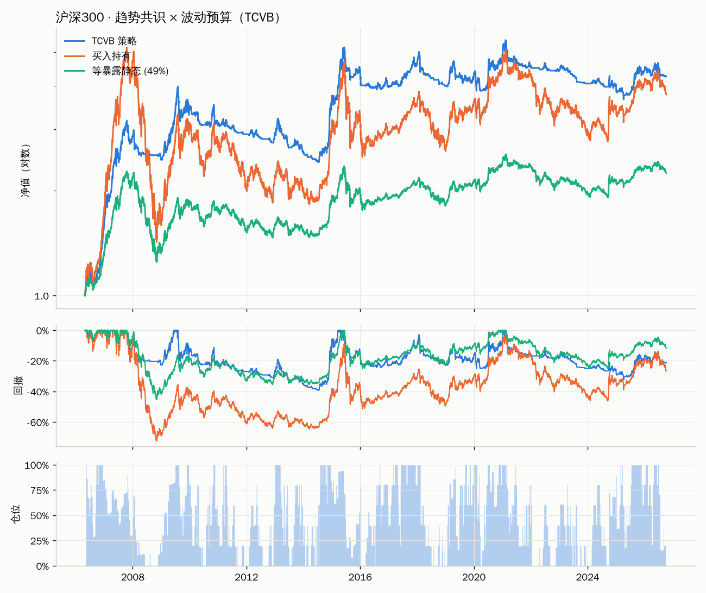
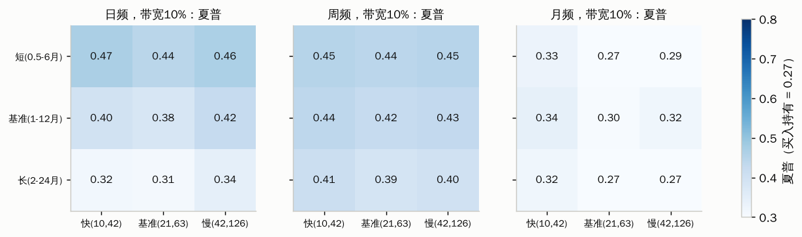
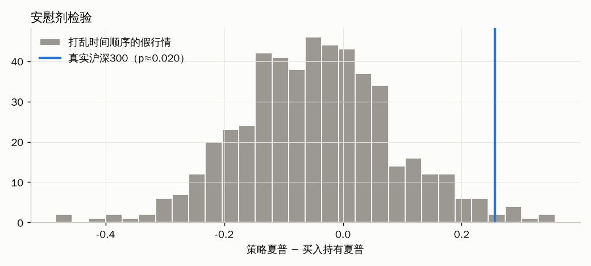

# 沪深300「趋势共识 × 波动预算」策略（TCVB）

> 一句话：**5 个时间尺度里有几个在涨，就拿几成仓；市场比平时更颠簸，就再按比例减一点。**
> 不看估值，不预测点位，不挑"最优参数"，只承认两件事：趋势有惯性，高波动期的风险补偿不划算。

---

## 1. 为什么换一条路

估值择时（PE/PB 百分位、股债性价比）的问题是**锚会漂**：成分股结构变了，利率中枢变了，"便宜"的定义跟着变。再怎么修补，最后都得回答"什么才算正常估值"，而这个问题本身就要用数据去拟合。

TCVB 完全不用估值，只用价格本身，而且只依赖两条**不是在沪深300上发现的**规律：

| 规律 | 证据来源 | 经济逻辑 |
|---|---|---|
| 时间序列动量：过去 1–12 个月涨的资产，未来倾向于继续涨 | 58 个期货市场（Moskowitz, Ooi, Pedersen 2012）、跨越百年的多资产数据（Hurst, Ooi, Pedersen 2017） | 信息扩散慢、投资者反应不足，随后羊群与追涨形成延续；A 股散户占比高，这种行为特征更明显 |
| 波动聚集 + 高波动期风险收益比更差 | 美股等多市场（Moreira & Muir 2017） | 波动率今天高明天大概率也高，但预期收益不会同比例上升，高波动时持有同样仓位"不划算" |

因为规律来自别的市场和别的时期，沪深300 对它来说相当于**样本外**。这是避免过拟合的第一道、也是最重要的一道防线：**先有逻辑，再看数据；而不是从数据里找逻辑。**

---

## 2. 策略规则（可直接执行）

**每周最后一个交易日收盘后计算，下一个交易日开盘执行。**

**第一步：趋势得分 `T`（0~1）**

分别比较今天收盘价和 21、42、63、126、252 个交易日前（≈1、2、3、6、12 个月）的收盘价：

```
T = （5 个比较里"今天更高"的个数）/ 5      → 取值 0, 0.2, 0.4, 0.6, 0.8, 1
```

**第二步：波动缩放 `V`（0~1）**

```
当前波动 = （过去 21 日日收益标准差 + 过去 63 日日收益标准差）/ 2 × √252
常态波动 = 从数据起点到今天，所有"当前波动"的中位数（至少要 1 年数据）
V = min(1, 常态波动 / 当前波动)
```

**第三步：目标仓位**

```
目标仓位 = T × V          ∈ [0, 100%]，不加杠杆、不做空
```

**第四步：调仓带宽**

目标仓位与当前实际仓位相差 **≥ 10 个百分点**才交易，否则不动。其余资金放货币基金或国债逆回购。

**工具：** 沪深300 ETF（如 510300、159919，选规模大、费率低、折溢价小的）。

**示例（数据截至 2026-10-08）：** 5 个尺度全部下跌 → T = 0；当前波动 16.7% 低于常态 20.0% → V = 1；目标仓位 **0%**。

---

## 3. 参数：全部事前写死，没有一个是优化出来的

| 参数 | 取值 | 为什么是它（不是因为回测好） |
|---|---|---|
| 趋势尺度 | 1/2/3/6/12 个月 | 动量文献的标准范围；**5 个等权投票**，不挑最好的那个，参数风险被分散 |
| 趋势判断 | 只看涨跌方向 | 不需要"涨多少才算强"这类阈值 |
| 波动窗口 | 1 个月和 3 个月取平均 | 同样是分散，不押注单一窗口 |
| 目标波动 | 扩展窗口中位数 | 没有"目标 15%"这类人为数字；只用当时已知的数据 |
| 决策频率 | 每周 | 介于日频（噪声大、交易多）和月频（反应慢）之间的常规选择 |
| 调仓带宽 | 10% | 避免频繁小额调仓；连续仓位本身就不怕阈值选不准 |
| 交易成本 | 单边 0.10% | ETF 佣金 + 滑点 + 折溢价的保守估计 |

**自由度统计：** 真正可调的只有 4 类（趋势尺度族、波动窗口、频率、带宽），全部在看到回测结果之前写入 `strategy.py`。主回测只跑了一次，之后的所有检验结果都**没有反过来修改任何参数**——包括下面那些对策略不利的发现。

---

## 4. 防过拟合与防前视偏差的设计

| 风险 | 本策略的处理 |
|---|---|
| **前视偏差（未来函数）** | t 日信号只用 t 日收盘及以前数据；常态波动用扩展窗口；**次日开盘**才执行；持仓权重随价格自然漂移，逐日模拟 |
| **参数挑选** | 不优化；多尺度等权投票；连续仓位代替硬阈值 |
| **结果只是"少拿仓位"** | 与**等暴露静态组合**（始终持有同样平均仓位）比较，而不只是和满仓比 |
| **只在这组参数上好** | 108 组相邻参数全部回测，看分布和中位数 |
| **只是运气 / 数据挖掘** | 安慰剂检验：打乱时间顺序摧毁趋势，看优势是否消失 |
| **只适用于沪深300** | 参数不改，直接跑中证500 |
| **依赖某一段行情** | 四个五年分段、逐年、14 个不同起点 |
| **执行假设过于乐观** | 成本 0~0.5%、执行延迟 0~3 日 |

---

## 5. 回测结果（2006-04 ~ 2026-10，沪深300 价格指数）



| | TCVB 策略 | 买入持有 | 等暴露静态（49% 仓位）|
|---|---|---|---|
| 年化收益 | **7.3%** | 6.7% | 4.0% |
| 年化波动 | 13.7% | 24.8% | 12.2% |
| 夏普（无风险=0）| **0.59** | 0.39 | 0.39 |
| 最大回撤 | **−39.3%** | −72.3% | −45.2% |
| 卡玛 | **0.19** | 0.09 | 0.09 |
| 平均仓位 | 49% | 100% | 49% |
| 年调仓次数 | ≈21 次 | – | – |

**稳健性检验摘要**（完整表格见 `results/robustness_report.md`）：

1. **参数高原，而非孤峰。** 108 组相邻参数中，**95%** 的夏普高于买入持有，**97%** 高于各自的等暴露静态组合，**100%** 最大回撤更小。日频和周频整片稳定，月频明显变弱，但仍不差于买入持有。
   
2. **安慰剂检验通过。** 在 500 条打乱时间顺序的假行情上，策略相对买入持有的夏普优势中位数为 **−0.05**，真实数据为 **+0.26**，单侧 p ≈ **0.02**。说明优势来自真实的趋势结构，而不是"少拿仓位"的机械效果。
   
3. **跨市场成立。** 参数不改直接用于中证500：夏普 0.59 对比 0.47，最大回撤 −49% 对比 −72%。
4. **成本不敏感。** 单边成本从 0.1% 提高到 0.5%，夏普从 0.59 降到 0.44，仍高于买入持有。
5. **执行延迟不敏感。** 延迟 1~3 日，夏普在 0.51~0.59 之间。

---

## 6. 必须正视的弱点（同样来自检验，没有为此修改策略）

- **主要价值在于躲过大熊市，而不是多赚钱。** 2006–2015 年明显占优，**2016–2020 年落后**（年化 3.3% 对比 8.5%）。从 2016 年以后任一年开始持有到今天，年化收益都不如买入持有，但最大回撤始终更小（−32% 对比 −46%）。
- **逐年只有 43% 的年份跑赢。** 牛市年份平均只拿到买入持有约一半的涨幅（26% 对比 47%），熊市年份亏损约减半（−9% 对比 −19%）。震荡市会反复"追涨杀跌"，产生磨损。
- **波动缩放部件在沪深300上没有带来增益。** 只用趋势时夏普同样为 0.59，年化反而更高（8.6%）。保留它是基于跨市场证据的事前设计，并且它确实降低了波动；如果你更看重收益，"只用趋势"版本是同样合理的选择。但**不要因为这次回测就去掉它**，否则就开始了"看结果改规则"。
- **短周期族（0.5–6 个月）在回测里更好**（夏普 0.44–0.47 对比 0.38–0.44）。同理，不要据此切换，这正是热力图要提醒的"挑最亮格子"的冲动。
- **价格指数不含分红**，约少算 2% 每年。若同时计入股息 2% 和现金收益 2%：策略年化 9.4%、夏普 0.73；买入持有年化 8.8%、夏普 0.46。结论方向不变。
- **约 20 年数据、2~3 个大周期**，统计力有限。安慰剂检验 p ≈ 0.02 已经算不错，但远不是铁证。

**合理预期：** 这是一个**降低回撤、换取更平稳持有体验**的策略，长期收益和买入持有大致相当。它的作用是让你在 2008 年、2018 年、2022 年这类行情里拿得住，而不是在牛市里跑赢。

---

## 7. 文件与运行

```
hs300_strategy/
├── 策略说明.md            ← 本文件
├── strategy.py            ← 策略本体：参数、信号、回测引擎、绩效指标、实盘信号
├── robustness.py          ← 七项稳健性检验，生成 results/
├── data/
│   ├── hs300.csv          ← 沪深300 日线 2005-01 ~ 2026-10（open/high/low/close）
│   └── csi500.csv         ← 中证500，用于跨市场检验
└── results/
    ├── robustness_report.md   ← 全部检验结果表格
    ├── backtest_daily.csv     ← 逐日净值、仓位、信号
    ├── param_grid.csv         ← 108 组参数的结果
    └── *.png                  ← 图表
```

```bash
pip install pandas numpy matplotlib tabulate
python strategy.py                 # 主回测
python strategy.py --signal        # 实盘：打印最新目标仓位
python strategy.py --akshare --signal   # 本地联网时用 akshare 拉最新数据（pip install akshare）
python strategy.py --csv 你的数据.csv --signal   # 需含 date, open, close 三列
python robustness.py               # 重跑全部检验（约 40 秒）
```

**数据来源：** 公开的 qlib 数据集（GitHub: chenditc/investment_data，2026-10-08 版）。已核对关键点位：2007-10-16 收盘 5877.20，2015-06-12 中证500 收盘 11545.89。实盘前建议用你自己的数据源（中证指数官网、Wind、理杏仁等）再跑一遍。

**实盘纪律：** 每周只看一次；严格按 `--signal` 输出执行；**任何时候都不要根据最近的表现修改参数**。如果确实想改，先写下理由，再用 `robustness.py` 的全部检验重新过一遍，并且接受"改完之后的回测已经不再是样本外"这一事实。

*本文件仅为研究与学习用途，不构成投资建议。*
